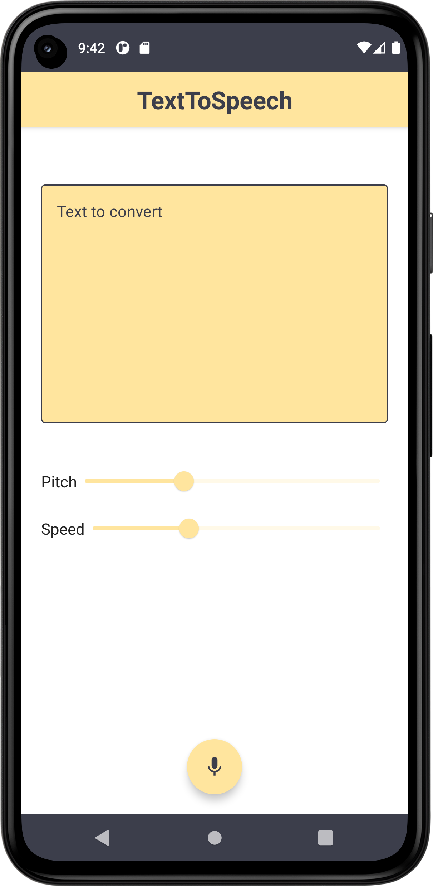

# ComposeSpeechAndText
> <b>Author: Nicola De Nicolais</b>

## 📍 Description
Android application built with Kotlin and Jetpack Compose that shows how to use the functions:<br/>

#### Speech-to-Text (STT)
About this, Android provides an Intent based API which launches Google's Speech Recognition service and returns back the text result to you. There is a catch though - the device will require Google Search app for the service to work.<br>
In the app this function allows the user to:
- Capture voice input from the device’s microphone.
- Convert the input captured by the microphone and show it as text on the display.
- Save the displayed text in a text file with extension .txt.

#### Text-to-Speech (TTS)
About this, the Text-to-speech API, unlike Speech Recognition, is available without Google Services, and can be found in android.speech.tts package.<br/>
In the app this function allows the user to:
- Insert a text inside the box displayed on the display.
- Set the tone and speed of the voice that reads the entered text.
- Listen to the text inserted through the speaker of the device.

## ✏️ Customization
You can custom some aspects of app:
#### Save folder
Change the path  where the text of Speech-to-Text file will be saved.
If you want you can also avoid creating a folder in which to save files but let them be saved directly in the default folder

#### Language
Change the value of *txtToSpeech.language* to set your prefered language according the available languages listed in this doc:

https://docs.oracle.com/javase/7/docs/api/java/util/Locale.html

#### Pitch
Change the value of *pitch's Slider* of Text-to-Speech to change how fast your device reads aloud.

#### Speech rate
Change the value of *speechRate's Slider* of Text-to-Speech to alter the tone of the spoken voice.

## 🛠️ Package Structure

```
com.denicks21.speechandtext     # Root Package
|
├── navigation                  # Navigation folder
│   ├── NavGraph                # Contains all of app destinations and actions.
│   └── NavScreens              # Contains a sealed class with object corresponds to a screen and its routes.
|
├── screen                      # App screens folder
|   │   ├── HomePage            # Main page of the app.
|   │   ├── InfoPage            # Page containing information about the app and developer profile.
|   │   ├── IntroPage           # Splashscreen of the app.
|   │   ├── SpeechToTextPage    # Page with the function Speech to Text.
|   │   ├── TextToSpeechPage    # Page with the function Text to Speech.
│
├── ui                          # UI resources folder
│   ├── composables             # Composable components
|   │   ├── CustomBackPress     # Component that control and prevent back button action.
|   │   ├── CustomDrawer        # Navigation drawer menu with app screens.
|   │   ├── CustomTopBar        # Bar that represent the app name and drawer menu.
|
├── theme                       # Theme components folder
|   │   ├── Color               # Color palette used by the app.
|   │   ├── Shape               # Components shapes of Compose used by the app.
|   │   ├── Theme               # Theme used by the app.
|   │   ├── Type                # Typography styles for the fonts used by the app.
|
├── MainActivity                # Main activity
```

## 📎 Screenshots
<p float="left">



